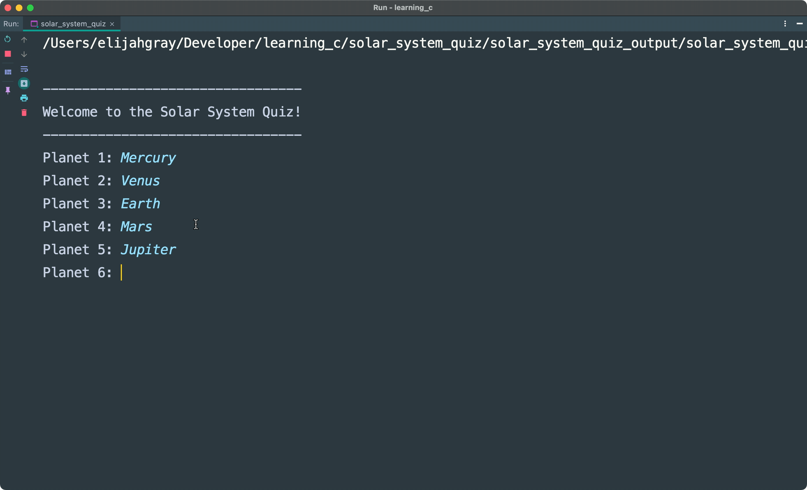

# C Learning Portfolio
> A repository containing many subdirectories showing an understanding of the C Programming Language.

#### C is a general purpose, procedural programming language. It supports:
* Structured Programming
* Lexical Variable Scope
* Recursion

## Project Highlights

#### Planet Order CLI Quiz

## Project Structure
The top-level directory contains multiple subdirectories. Each subdirectory is an individual project with it's own main.c file.  